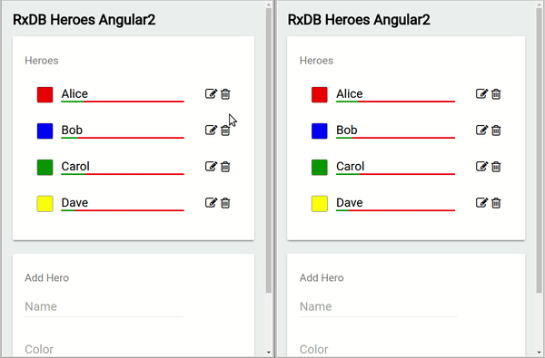

# RxDocument
A document is a single object which is stored in a collection. It can be compared to a single record in a relational database table.


## insert
To insert a document into a collection, you have to call the collection's .insert()-function.
```js
myCollection.insert({
  name: 'foo',
  lastname: 'bar'
});
```

## find
To find documents in a collection, you have to call the collection's .find()-function.
```js
myCollection.find().exec() // <- find all documents
  .then(documents => console.dir(documents));
```


## Functions

### get()
This will get a single field of the document. If the field is encrypted, it will be automatically decrypted before returning.

```js
var name = myDocument.get('name'); // returns the name
```

### proxy-get
As RxDocument is wrapped into a [Proxy-object](https://developer.mozilla.org/de/docs/Web/JavaScript/Reference/Global_Objects/Proxy), you can also directly access values instead of using the get()-function.

```js
  // Identical to myDocument.get('name');
  var name = myDocument.name;
  // Can also get nested values.
  var nestedValue = myDocument.whatever.nestedfield;
```

### set()
To change data in your document, use this function. It takes the field-path and the new value as parameter. Note that calling the set-function will not change anything in your storage directly. You have to call .save() after to submit changes.

```js
myDocument.set('firstName', 'foobar');
console.log(myDocument.get('firstName')); // <- is 'foobar'
```

### proxy-set
As RxDocument is wrapped into a [Proxy-object](https://developer.mozilla.org/de/docs/Web/JavaScript/Reference/Global_Objects/Proxy), you can also directly set values instead of using the set()-function.

```js
myDocument.firstName = 'foobar';
myDocument.whatever.nestedfield = 'foobar2';
```

### save()
This will update the document in the storage if it has been changed. Call this after modifying the document (via set() or proxy-set).
```js
myDocument.name = 'foobar';
await myDocument.save(); // submit the changes to the storage
```

### remove()
This removes the document from the collection.
```js
myDocument.remove();
```

### update()
Updates the document based on the [mongo-update-syntax](https://docs.mongodb.com/manual/reference/operator/update-field/), based on [modifyjs](https://github.com/lgandecki/modifyjs#implemented).

```js
await myDocument.update({
    $inc: {
        age: 1 // increases age by 1
    },
    $set: {
        fistName: 'foobar' // sets firstName to foobar
    }
});
```

### atomicUpdate()
When you run many save-operations on the same RxDocument in a very short timespan, it can happen that you get a `409 Conflict`-Error.
This means that you did run a `.save()` on the document, while the previous save-operation was still running.
To prevent these types of errors, you can run atomic update-operations.
`atomicUpdate()` has a function as argument, which transforms the document and then automatically runs a `save()`.
It returns a promise to notify you when the given atomic-update has finished.

Example to reproduce the 409-error:
```js
[1,2,3,4].forEach(nr => {
    myDocument.age = nr;
    myDocument.save();
});
// throws
```

Usage of atomicUpdate:

```js
let lastPromise;
[1,2,3,4].forEach(nr => {
    lastPromise = myDocument.atomicUpdate(function(doc){
        doc.age = nr;
    });
});
await lastPromise;
console.dir(myDocument.age); // 4
```


### Observe $
Calling this will return an [rxjs-Observable](http://reactivex.io/rxjs/manual/overview.html#observable) which emits all change-Events belonging to this document.

```js
// get all changeEvents
myDocument.$
  .subscribe(changeEvent => console.dir(changeEvent));
```

### get$()
This function returns an observable of the given paths-value.
The current value of this path will be emitted each time the document changes.
```js
// get the life-updating value of 'name'
var isName;
myDocument.get$('name')
  .subscribe(newName => {
    isName = newName;
  });

myDocument.set('name', 'foobar2');
await myDocument.save();

console.dir(isName); // isName is now 'foobar2'
```

### proxy-get$
You can directly get value-observables for a fieldName by adding the dollarSign ($) to its name.

```js
// top-level
var currentName;
myDocument.firstName$
  .subscribe(newName => {
    currentName = newName;
  });
myDocument.firstName = 'foobar2';
await myDocument.save();
console.dir(currentName); // currentName is now 'foobar2'

// nested
var currentNestedValue;
myDocument.whatever.nestedfield$
  .subscribe(newName => {
    currentNestedValue = newName;
  });
myDocument.whatever.nestedfield = 'foobar2';
await myDocument.save();
console.dir(currentNestedValue); // currentNestedValue is now 'foobar2'
```

### deleted$
Emits a boolean value, depending on whether the RxDocument is deleted or not.

```js
let lastState = null;
myDocument.deleted$.subscribe(state => lastState = state);

console.log(lastState);
// false

await myDocument.remove();

console.log(lastState);
// true
```

### get deleted
A getter to get the current value of `deleted$`.

```js
console.log(myDocument.deleted);
// false

await myDocument.remove();

console.log(myDocument.deleted);
// true
```


### synced$
Emits a boolean value of whether the RxDocument is in the same state as its value stored in the database.
This is useful to show warnings when two or more users edit a document at the same time.

Browser tab A
```js
let lastState = null;
myDocument.synced$.subscribe(state => lastState = state);
console.log(lastState);
// true

myDocument.firstName = 'foobar';
console.log(lastState);
// true
```

Browser tab B
```js
myDocument.firstName = 'barfoo';
await myDocument.save();
```

Browser tab A
```js
console.log(lastState);
// false
```

<details>
<summary>
  <b>Example with Angular 2</b>
</summary>

```html
<div *ngIf="!(hero.synced$ | async)">
    <h4>Warning:</h4>
    <p>Someone else has <b>changed</b> this document. If you click save, you will overwrite the changes.</p>
    <button md-raised-button color="primary" (click)=hero.resync()>resync</button>
</div>
```


</details>

### get synced
A getter to get the current value of `synced$`.

Browser tab A
```js
console.log(myDocument.synced);
// true

myDocument.firstName = 'foobar';
console.log(myDocument.synced);
// true
```

Browser tab B
```js
myDocument.firstName = 'barfoo';
await myDocument.save();
```

Browser tab A
```js
console.log(myDocument.synced);
// false
```

### resync()
If the RxDocument is not in sync (synced$ fires `false`), you can run `resync()` to overwrite own changes with the new state from the database.

```js
myDocument.firstName = 'foobar';

// now someone else overwrites firstName with 'Alice'

myDocument.resync();

console.log(myDocument.firstName);
// Alice
```

### isRxDocument
Returns true if the given object is an instance of RxDocument. Returns false if not.
```js
const is = RxDB.isRxDocument(myObj);
```

---------
If you are new to RxDB, you should continue [here](./rx-query.md)
